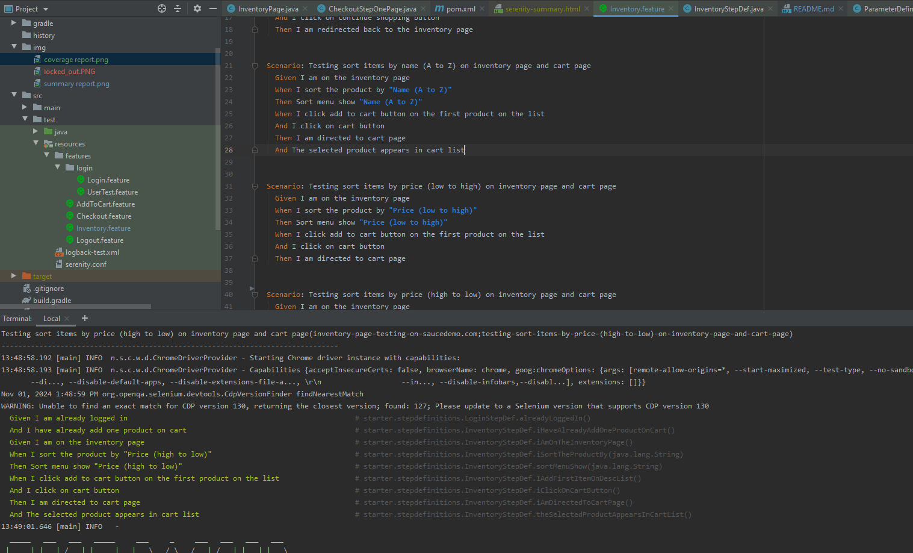

## 📓 Testing Documentation

### SauceDemo Test
This project contains an automated test scenario for the SauceDemo website using Selenium and Java 11

### Prerequisites
Java 11 installed
Selenium WebDriver library installed
Chrome WebDriver executable installed and in the system PATH

### Setup
Clone the repository to your local machine.
Install cucumber plugin

### Test Scenario in scope
The test scenario performs the following steps:

  1.  Create a browser instance and set up the test environment.
  2.  Open the login page and verify the Swag Labs logo.
  3.  Login with valid credentials.
  4.  Open the menu to access the Logout button and verify its presence.
  5.  Verify that the inventory page is displayed.
  6.  Validate the sorting order on product page- ASC, DESC etc
  7.  Navigate to the product detail page and verify the product name.
  8.  Add the item to the cart and verify the "Remove" button.
  9.  Navigate to the shopping cart page and verify the item in the cart.
  10.  Continue with the checkout process and verify the checkout page.
  11. Enter required shipping and payment information.
  12. Proceed to the confirmation page and verify the item in the overview.
  13. Logout from the website.
  14. Tear down the test environment - WIP

The test will be executed with the provided test data (username and password). If the test passes, the message "test passed" will be displayed.

### 🏎️ How to Run all Test Scenarios

1. Clone the repository
```bash
  $ git clone 
```

2. Open this Project Repository on Intellij IDE and Run this on the IDE terminal

### Running the Test - entire feature tests
```bash
  $ mvn clean verify
```
### Running specific tag
```bash
  $ mvn clean verify -D tags="tagName"
```

## 📝 Reports
target/site/serenity/01f5288b80adbd3af52a8ed68a4a616d3164f750229f80da1ef344382d948835.html

#### Summary Report


#### Coverage Report


#### Automation Testing When Run in Intellij IDE and chrome
